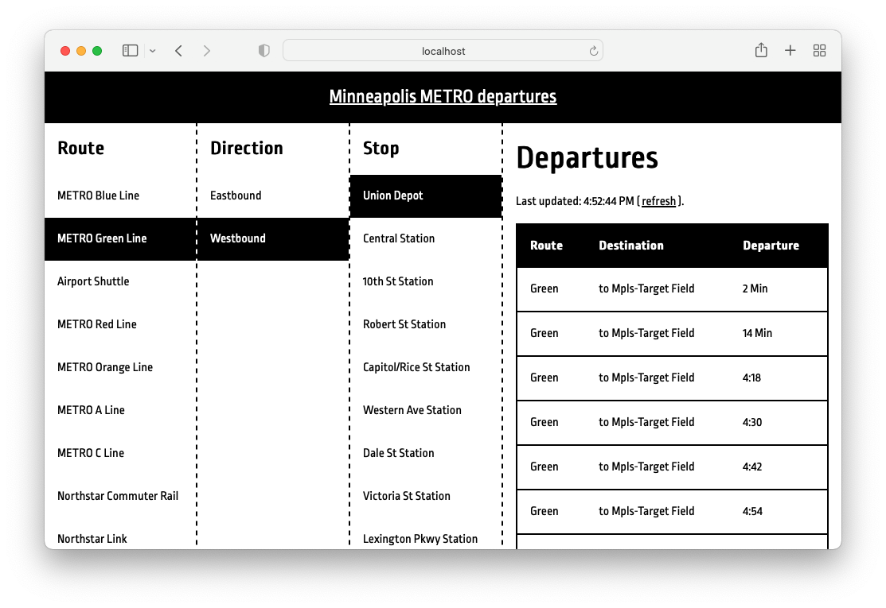

# METRO Departures

[](https://metro-departures.netlify.app/route/902/direction/1/stop/UNDP)

Production: https://metro-departures.netlify.app/route/902/direction/1/stop/UNDP

## Development Setup

1. Install the [Netlify CLI](https://www.netlify.com/products/dev/):

```sh
npm i -g netlify-cli
```

If you have previously installed the Netlify CLI, you should update it to the latest version:

```sh
npm i -g netlify-cli@latest
```

2. Sign up and log in to Netlify:

```sh
netlify login
```

3. Create a new site:

```sh
netlify init
```

## Development

The Netlify CLI starts your app in development mode, rebuilding assets on file changes.

```sh
npm run dev
```

Open up [http://localhost:3000](http://localhost:3000), and you should be ready to go!

## Testing

The Cypress intregration tests will open up and run alongside the development, so make sure [http://localhost:3000](http://localhost:3000) is running.

```sh
npm run test
```

## Deployment

There are two ways to deploy your app to Netlify, you can either link your app to your git repo and have it auto deploy changes to Netlify, or you can deploy your app manually. If you've followed the setup instructions already, all you need to do is run this:

```sh
npm run build
# preview deployment
netlify deploy

# production deployment
netlify deploy --prod
```
